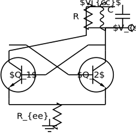
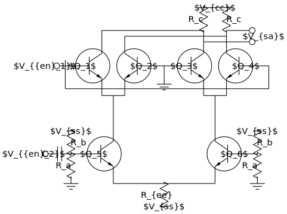
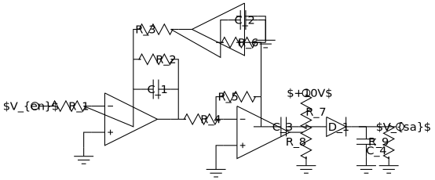

# Figuras — circuit_macros figures by André Leite

These are figures from **André Leite's** personal collection *"minhas lindas
figuras"* (Recife, February 2011) — diagrams he made over ~10 years. Part of the
collection was written for **circuit_macros** (the `m4` macro package by
J. D. Aplevich), which is part of the *pic* family; the rest were PStricks.

The circuit_macros figures that **rpic renders** are collected here, one `.pic`
per figure (the numbers match the figures in the original `Figuras.pdf`).

**Figures that draw with raw primitives** (line/circle/…) are self-contained —
render with plain rpic:

```sh
rpic --svg examples/figuras/fig01.pic -o fig01.svg
```

**Figures that use the circuit_macros element API** (`resistor(up_ dimen_)`,
`bi_tr(…)`, `opamp(…)`, …) need the native circuit library (`-c`); they pull in
the compatibility shim with `copy "circuit_macros.pic"`:

```sh
rpic -c --svg examples/figuras/fig30.pic -o fig30.svg
```

## How they were adapted

The original sources are circuit_macros `m4`. To run them in rpic, each file is
prefixed with a small **circuit_macros-compatibility shim**
([`circuit_macros.pic`](circuit_macros.pic)) that:

- neutralises `include(libcct.m4)` and `cct_init` (no-ops);
- defines the base dimension `dimen_` and the direction aliases
  `right_`/`left_`/`up_`/`down_`;
- adapts the circuit_macros **direction+length element API** to rpic's native
  **two-point** circuit library — *reusing the same native geometry*. Each
  linear element (`resistor`/`capacitor`/`inductor`/`diode`) draws an invisible
  spine along its direction and then calls the native two-point form; `bi_tr`
  and `opamp` are blocks exposing `.B/.E/.C` and `.In1/.In2/.Out` terminals,
  built on sign-parameterized versions of the native `npn`/`pnp`/`opamp` (so the
  reflected `R` and `down_`/`left_` orientations come for free).

In addition:

- **PStricks colour directives** (`\newrgbcolor`, `\psset`, …) are removed — rpic
  targets SVG, so the geometry renders but the original colours are not applied.
- **LaTeX math labels** (`"$\omega$"`, `"$Q_4$"`, …) render as **literal text**;
  rpic does not typeset math.

So these are **geometry-faithful** renderings of the originals, not pixel-perfect
reproductions.

## Coverage

Of the collection's 48 circuit_macros figures, **44 render** and are included
here: 27 that draw with raw primitives, plus 17 that exercise the element-API
compatibility shim (`fig05 21 22 23 24 25 26 27 28 29 30 31 32 33 45 46 47` —
linear elements, bipolar transistors, op-amps, element boxes (`ebox`), current
sources (`source`), `with .start at …` element placement, and lines continued
across a newline after `then`).

The remaining four (`fig09 11 14 48`) pull in circuit_macros' **`libgen.m4`**
general-macro library, which uses `m4` argument constructs (`$#`, `$@`, …) that
rpic's lighter macro layer does not implement.

## A few highlights






## Credit

Figures © **André Leite** (`leite.andre@gmail.com`), from *"minhas lindas
figuras"*, 2011. circuit_macros © J. D. Aplevich (see the top-level
[`ACKNOWLEDGMENTS.md`](../../ACKNOWLEDGMENTS.md)).
