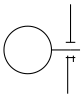
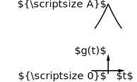
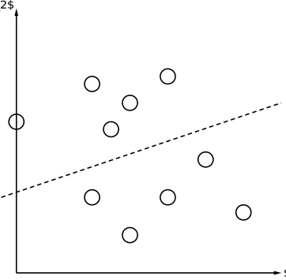
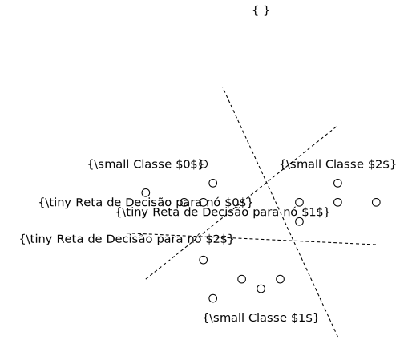

# Figuras — circuit_macros figures by André Leite

These are figures from **André Leite's** personal collection *"minhas lindas
figuras"* (Recife, February 2011) — diagrams he made over ~10 years. Part of the
collection was written for **circuit_macros** (the `m4` macro package by
J. D. Aplevich), which is part of the *pic* family; the rest were PStricks.

The circuit_macros figures that **rpic renders** are collected here, one `.pic`
per figure (the numbers match the figures in the original `Figuras.pdf`). Each is
self-contained — render with plain rpic:

```sh
rpic --svg examples/figuras/fig01.pic -o fig01.svg
```

## How they were adapted

The original sources are circuit_macros `m4`. To run them in rpic, each file is
prefixed with a small **circuit_macros-compatibility shim** that:

- neutralises `include(libcct.m4)` and `cct_init` (no-ops);
- defines the base dimension `dimen_` and the direction aliases
  `right_`/`left_`/`up_`/`down_`.

In addition:

- **PStricks colour directives** (`\newrgbcolor`, `\psset`, …) are removed — rpic
  targets SVG, so the geometry renders but the original colours are not applied.
- **LaTeX math labels** (`"$\omega$"`, `"$Q_4$"`, …) render as **literal text**;
  rpic does not typeset math.

So these are **geometry-faithful** renderings of the originals, not pixel-perfect
reproductions.

## Coverage

Of the collection's 48 circuit_macros figures, **27 render** and are included
here. The remaining ones use circuit_macros' **element API** (e.g. `bi_tr(...)`,
`resistor(up_ dimen_)`, `.B`/`.E`/`.C` transistor terminals), which differs from
rpic's native circuit library (`resistor(A, B)`, two-point form) — supporting that
compatibility layer is future work.

## A few highlights






## Credit

Figures © **André Leite** (`leite.andre@gmail.com`), from *"minhas lindas
figuras"*, 2011. circuit_macros © J. D. Aplevich (see the top-level
[`ACKNOWLEDGMENTS.md`](../../ACKNOWLEDGMENTS.md)).
